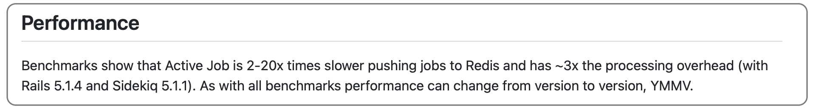

# Why

Sidekiq's wiki mentions a significant performance hit incurred by using ActiveJob: https://github.com/mperham/sidekiq/wiki/Active-Job#performance

I couldn't find reliable benchmarks about this, so I wrote this script.
See [bin/run_benchmarks](./bin/run_benchmarks).

# Results

_Tested on a MacBook Pro (2.3 GHz Quad-Core Intel Core i7), with Ruby 3.0.2, Rails 6.1.4, Sidekiq 6.3.1._

<table>
<tr>
<td></td>
<td>ActiveJob jobs</td>
<td>Native Sidekiq jobs</td>
</tr>

<tr>
<td>Enqueuing 100k jobs</td>
<td>26 sec</td>
<td><strong>11 sec</strong></td>
</tr>

<tr>
<td>Enqueuing & processing 100k jobs</td>
<td>3 min 19 sec</td>
<td><strong>1 min 26 sec</strong></td>
</tr>
</table>

Using Sidekiq natively is at least 2x faster than using it wrapped in ActiveJob.
There are also probably some memory usage gains too, although I didn't measure them.

# Disclaimer

Benchmarks are inherently limited in how much they can reveal.  

While using Sidekiq natively is most likely always going to be faster and lighter than wrapping it in ActiveJob, the performance gains may be negligible depending on what your app does.  

For example, if all your jobs spend one second (it's long) performing SQL queries, processing 100k jobs (with 1 worker and 1 thread) will take 16min 40sec via ActiveJob, and only be ~1 second faster with native Sidekiq Workers.
